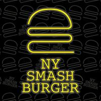

<div align="center">

  

  # 🍔 NYSMASH BURGER

  **Il Vero Smash Burger Newyorkese a Salerno — Ma senza il jet lag.**

  [](https://developer.mozilla.org/it/docs/Web/HTML)
  [](https://developer.mozilla.org/it/docs/Web/CSS)
  [](https://developer.mozilla.org/it/docs/Web/JavaScript)
  [](#)
  [](#dove-siamo)

</div>

---

## 📖 In Breve

**NySmash Burger** è la web app ufficiale del locale di smash burger d'ispirazione newyorkese con sede a **Salerno (Via Irno 24)**. 

Con un design moderno caratterizzato da tonalità dark mode, dettagli al neon fluo, video d'impatto a tutto schermo e riferimenti all'iconica cultura Arcade anni '90, l'applicazione offre un'esperienza utente immersiva per esplorare il menu, verificare in tempo reale lo stato di apertura del locale e ordinare d'asporto o a domicilio in un click.

> *"Conta gli attimi, non le calorie."*

---

## ⚡ Caratteristiche Principali

- 🎥 **Hero Video Background**: Copertina dinamica ad alto impatto visivo con riproduzione video in background ed effetti di sfumatura dark.
- 🕒 **Live Store Status (Stato Apertura in Tempo Reale)**: Calcolo dinamico via JavaScript degli orari di apertura (Martedì - Domenica 19:00 - 23:30) con badge di stato in tempo reale (*Aperto Ora*, *Chiuso*, *Chiuso Oggi*, *Apre alle 19:00*) e risalto automatico del giorno corrente nel footer.
- 🍔 **Menu Digitale Interattivo**: Vetrina dei Best Seller con card animate per ogni panino (*Lo Smash Newyorkese*, *Manhattan*, *Broadway*, *Central Park*, *Little Italy*, *NY Cheeseburger*), dettagli sugli ingredienti e badge dedicati.
- 🕹️ **Arcade & Street Experience Section**: Sezione dedicata all'atmosfera vintage del locale con cabinato Arcade '90 (Puzzle Bobble), fritti croccanti e video experience.
- 📍 **Mappa Dark-Mode & Pin Neon Animato**: Mappa interattiva Google Maps integrata con stile dark ed un marker al neon fluo animato con effetto pulsante.
- 📱 **Mobile-First & Navigation Drawer**: Menu di navigazione responsive con drawer laterale per dispositivi mobile e sfocatura con effetto vetro (*glassmorphism*) all'avvio dello scorrimento.
- 🛒 **Integrazione Piattaforma Ordini**: Collegamento diretto con la piattaforma **Booxit** per ordini veloci da asporto e consegna a domicilio.

---

## 🛠️ Tecnologie Utilizzate

| Componente | Tecnologia | Descrizione |
| :--- | :--- | :--- |
| **Markup** | HTML5 Semantico | Struttura accessibile, meta tag SEO e social OpenGraph |
| **Stile** | Vanilla CSS3 | Design system basato su variabili CSS, layout Flexbox/Grid, animazioni keyframes, neon glow e glassmorphism |
| **Logica Frontend** | JavaScript (ES6+) | Gestione scroll header, mobile drawer, Intersection Observer per nav attiva e calcolo live orari |
| **Media** | MP4 Video & Web Images | Video in streaming di background e immagini in formato ad alta definizione |
| **Servizi Esterni** | Google Maps API & Booxit | Mappa integrata e sistema di prenotazione/ordinazione online |

---

## 📂 Struttura del Progetto

```text
NySmash/
├── assets/
│   ├── photos/             # Immagini del brand, logo, sfondi neon e menu
│   │   ├── menu/           # Foto ad alta risoluzione dei singoli burger
│   │   ├── Logo.jpg
│   │   └── neon_concept.jpg
│   └── video/              # Video in background (.mp4)
│       ├── hero.mp4
│       └── arcade.mp4
├── css/
│   └── styles.css          # Fogli di stile principali, variabili e media queries
├── js/
│   └── main.js             # Logica JS (status store, nav observer, mobile menu)
├── .gitignore              # Esclusioni Git
├── index.html              # Landing page principale
└── README.md               # Documentazione del progetto
```

---

## 🚀 Come Eseguire il Progetto in Locale

Non è necessaria alcuna installazione di pacchetti o dipendenze complesse. Il progetto è realizzato in HTML, CSS e JavaScript puro.

### 1. Clona il repository
```bash
git clone https://github.com/tuo-username/NySmash.git
cd NySmash
```

### 2. Apri nel browser
Puoi aprire direttamente il file `index.html` nel tuo browser preferito:
```bash
# Su macOS
open index.html

# Su Linux
xdg-open index.html

# Oppure utilizza l'estensione Live Server su VS Code
```

---

## 📍 Dove Siamo e Contatti

- 📌 **Indirizzo**: Via Irno 24, 84135 Salerno (SA)
- 📞 **Telefono**: [+39 351 338 5986](tel:+393513385986)
- 📲 **Instagram**: [@new_york__smash_burger](https://www.instagram.com/new_york__smash_burger/)
- 🎵 **TikTok**: [@nysmashburger](https://www.tiktok.com/@nysmashburger)
- 🛵 **Ordina Online**: [Booxit NySmash Burger](https://booxit.it/app/nysmashburger)

---

## 👨‍💻 Autore & Sviluppo

Sviluppato con passione da **Alex** per **NySmash Burger**.

*Copyright &copy; 2026 NySmash Burger. Tutti i diritti riservati.*
